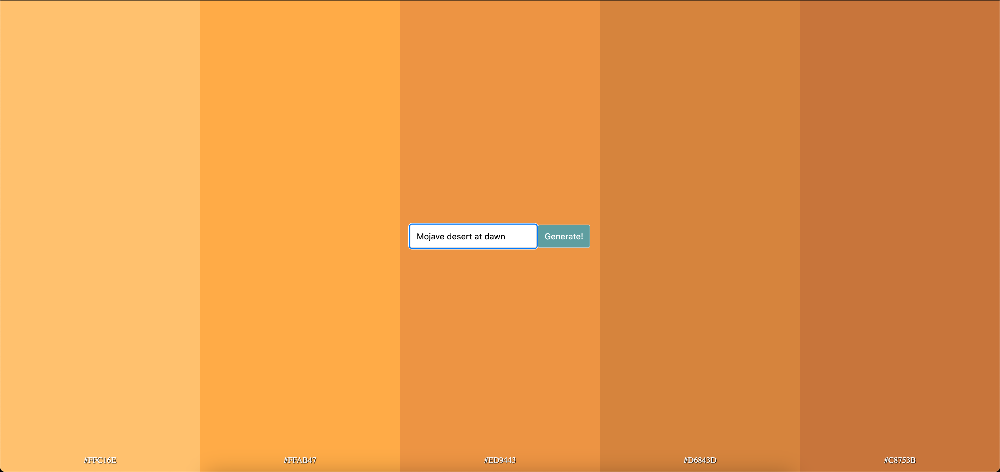

# color-palette-gpt
A simple color palette generator using OpenAI ChatGPT

# Installation
Get your OpenAI API key from https://openai.com/ and set it as an environment variable

Setup a virtual Python env
```shell
$ pyenv install 3.11.5 # only if necessary
$ pyenv virtualenv 3.11.5 $(cat .python-version)
$ pip install -r requirements.txt
```

Run the app and have some fun!
```shell
$ flask run [--debug]
```

